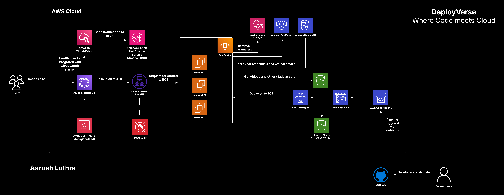

# 🚀 DeployVerse – Where Code Meets Cloud ☁️💻

**DeployVerse** is a simplified web hosting platform built on AWS that lets users deploy **static** and **dynamic websites** by simply uploading a `.zip` file — no need to manually set up configurations, policies, or permissions.

---

## 🌐 Live Demo

🔗 Try it now: [DeployVerse](https://deployverse.in)

---

## ✨ Features

- 🔸 **Static Hosting** – Upload HTML, CSS, JS files and go live instantly.
- 🔸 **Dynamic Hosting** – Upload full-stack apps with Node.js + Express backend support.
- 🔸 **JWT-based Authentication** – Secure login and protected routes.
- 🔸 **Seamless CI/CD** – Powered by AWS CodePipeline, CodeBuild, and CodeDeploy.
- 🔸 **No Manual AWS Setup Required** – IAM roles, policies, Route 53, and more are pre-configured.

---

## 📌 Upcoming Features

- MERN stack support  
- Monitoring & status dashboard  
- Extended language/runtime support

---

## 🤝 Contributing

We’re still building and expanding! Feel free to:
- Open issues
- Suggest new features
- Fork the repo and submit PRs

💙 All contributions are welcome!

---

## 📬 Feedback & Contact

We’d love to hear your thoughts, suggestions, or ideas.  
Connect with us on [LinkedIn](https://www.linkedin.com/in/aarush27) or open a GitHub issue.

---
